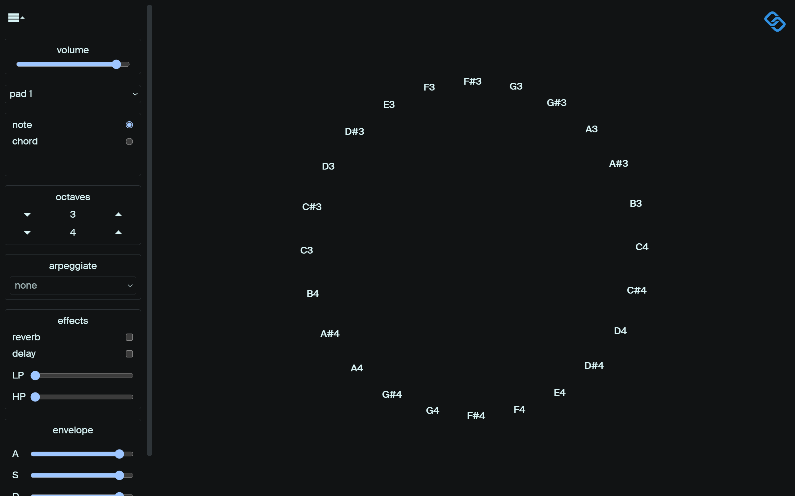

# congruent-chords

## work in progress

### Desription

Mainly a hobby project.

Play either chords or single notes with a single keypress/mouseclick. Includes full octave range support (1-8), 8 custom crafted samples, 5 arpeggiation types, 5 chord types, Attack/Release, volume control, lowpass/highpass, and reverb/delay effects.

### Current Status

- [x] Cycle through samples
- [x] Note & chord mode
- [x] Cycle through different chords
- [x] Resonsive
- [x] Hide controls
- [x] Display current note(s) & angles
- [x] Play notes with keyboard
- [x] 1-8 Octaves
- [x] Volume control
- [x] Attack/Release
- [x] Reverb
- [x] Delay
- [x] Lowpass/highpass
- [x] Click note to play
- [ ] Arp Mode